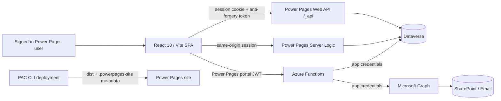

# GCP Nexus project context report

**Audit date:** 2026-07-24  
**Repository:** `GCP-SPA-final-version`  
**Branch inspected:** `master`  
**HEAD inspected:** `08b70bb` (`Deploy to prod (PowerPagesProduction / GCP Nexus)`)  
**Worktree note:** `src/pages/VerifyData.tsx` had a pre-existing local
modification and was not changed by this audit.

This is the living onboarding and architecture document for the repository.
Update it when architecture, integration boundaries, deployment behavior, or
major implementation decisions change.

## Executive summary

GCP Nexus digitizes GCP/GCPC contract-procurement request submission, review,
engagement, acceptance, acknowledgement, endorsement, role management, and
reporting workflows. It is a React/Vite single-page application hosted as a
Microsoft Power Pages code site, backed by an existing Dataverse schema.

The codebase has three execution surfaces:

1. The browser SPA in `src/`.
2. Power Pages and Dataverse metadata in `.powerpages-site/`, including
   same-origin server logic.
3. An Azure Functions backend in `api/` for integrations that need server-side
   credentials.

The most important architectural constraint is that the Dataverse data model is
owned outside this repository. Repository types and mappings mirror that schema;
they do not define it.

## System architecture



### Browser SPA

- Entry points: `src/main.tsx` and `src/App.tsx`.
- Framework: React 18, React Router 6, strict TypeScript, Vite 5.
- UI: Bootstrap/React Bootstrap, shared form components, repository CSS, and
  `lucide-react` icons.
- Charts: `recharts`.
- Routing includes submission, request list/detail/edit, verification, review,
  engagement, acceptance/letters, administrative management, profile, and
  dashboard pages.
- `RequireRole` gates sensitive routes in the UI, but server-side permissions
  remain authoritative.

### Dataverse access

- `src/shared/powerPagesApi.ts` is the central same-origin Web API client.
- It obtains and caches the Power Pages anti-forgery token, invalidates it on the
  relevant 403, retries 429/5xx responses, and provides OData helpers.
- Table-specific CRUD belongs under `src/shared/services/`.
- Clean frontend types live under `src/types/`.
- Dataverse choices live under `src/data/`.
- Form-to-parent/child/grandchild mappings are documented in `mapping.md` and
  implemented in each `src/forms/<matter>/api.ts`.

### Authentication and authorization

- Portal login/session state comes from
  `window.Microsoft.Dynamic365.Portal` through `src/services/authService.ts` and
  `src/context/AuthContext.tsx`.
- Localhost uses a mock portal user; `/_api`, `/_layout`, portal tokens, table
  permissions, and server logic cannot be fully exercised locally.
- Same-origin Dataverse calls use the portal session and anti-forgery token.
- Cross-origin Azure Function calls acquire a Power Pages portal token from
  `/_services/auth/token` through `src/shared/portalToken.ts`.
- `api/src/auth/validateToken.ts` validates portal-token signature, issuer,
  audience/application ID, and contact identity.
- The retired MSAL hidden-iframe design must not be restored. It timed out in the
  sandboxed Power Pages iframe because the nested authentication context could
  not complete reliably.
- UI role visibility is not authorization. Dataverse table permissions,
  Function-side admin checks, and server-logic role checks are the actual
  security controls.

### Azure Functions

The TypeScript Azure Functions project in `api/` currently contains:

- SharePoint file upload through Microsoft Graph.
- Notification email rendering and sending.
- Web-role list/assignment/removal through Dataverse.
- Legacy signatory functions and Dataverse helpers retained after the active
  frontend signatory path moved to Power Pages Server Logic.

The SPA authenticates to these functions with the portal token. The Function
uses server-side application credentials for Graph and Dataverse. The app secret
must never reach the browser.

### Power Pages Server Logic

`.powerpages-site/server-logic/` contains:

- `signatorymembers`: list members; add/remove with an in-code administrator
  check.
- `signatorythresholds`: read thresholds; set with an administrator check.
- `test`: a pre-existing test/example server logic.

`src/shared/signatoryApi.ts` calls the first two through the same-origin
`/_api/serverlogics/*` endpoints. Table permissions remain defense in depth.
See `server-logic/README.md` for the migration rationale and runtime smoke test.

### Power Pages site package

`.powerpages-site/` contains the deployable site metadata:

- website, language, page, template, snippet, and navigation metadata;
- Web API site settings;
- web roles and table permissions;
- server logic;
- a `web-files/` snapshot.

The current SPA must be built to `dist/` and supplied to PAC with
`--compiledPath`. The `web-files/` snapshot can be stale.

## Repository map

| Path | Responsibility |
|---|---|
| `src/App.tsx` | Route topology and route-level role gates |
| `src/pages/` | Route-level workflows and orchestration |
| `src/components/` | Reusable domain and UI components |
| `src/forms/` | Shared fields, multi-step framework, and matter forms |
| `src/forms/<matter>/api.ts` | Create/edit state-to-Dataverse mapping |
| `src/data/` | Canonical Dataverse choice mirrors and UI option helpers |
| `src/types/` | Clean domain and Dataverse request types |
| `src/shared/powerPagesApi.ts` | Same-origin Web API client |
| `src/shared/services/` | Table-specific data access |
| `src/context/AuthContext.tsx` | Portal user/contact/company hydration |
| `src/shared/portalToken.ts` | Portal JWT acquisition for Azure Functions |
| `src/shared/documents.ts` | Persisted document JSON handling |
| `api/src/functions/` | Azure Function HTTP endpoints |
| `api/src/auth/` | Function-call portal-token validation |
| `api/src/dataverse/` | Server-side Dataverse access |
| `api/src/sharepoint/` | Graph/SharePoint upload integration |
| `api/src/email/` | Notification templates and rendering |
| `.powerpages-site/` | PAC-deployable site metadata and server logic |
| `mapping.md` | Form-to-Dataverse field map |
| `contex.md` | Historical business requirements |
| `userguide.md` | End-user request workflow guide |
| `docs/` | Edit rollout and dated permissions audits |

## Business workflow and roles

The historical BRD defines these major roles:

- Requestor: submits and resubmits requests.
- Verifier: validates data/documents and routes or returns requests.
- Reviewer: conducts the GCP/GCPC review and records the decision.
- HOC/Head of GCP: accepts review output and acknowledgement steps.
- Endorser/Head of GCPC: completes endorsement steps.
- Working/Main GCPC: participates in review or receives read access.
- Administrators: manage roles, slots, engagements, signatories, templates, and
  dashboards.

The current status and decision-code reference is in `userguide.md` and
`src/data/requestChoices.ts`. The implementation source wins if the user guide
has not been updated.

## Matter types and form topology

Edit coverage is complete for 13 matter codes representing 14 Dataverse matter
values:

| Code | Matter/form area |
|---|---|
| `RTP` | Registration of Tender & Proposal List |
| `PBL` | Prospective Bidders List |
| `JVP` | JV / Partnership (Dataverse child uses the JVM prefix) |
| `ST/SP` | Submission of Tender / Proposal |
| `CAA` | Client Acceptance of Award |
| `PCCA` | Project Cost / Construction Analysis |
| `PP` | Procurement Plan |
| `VAP` | Vendor Appointment and Procurement |
| `Others` | Shared form for GCPC and GCP "other" values |
| `CPR` | Contract Progress / Procurement Report |
| `CI` | Contractual Issue |
| `R-PCCA` | Revised PCCA |
| `R-PP` | Revised Procurement Plan |

The exact logical names, entity sets, navigation properties, primary-name
quirks, JSON-serialized repeatable fields, and intentionally display-only
uploads are recorded in `mapping.md`.

## Durable implementation decisions

### D-001: Dataverse owns the schema

Do not evolve the database speculatively from frontend code. Choice integers and
logical names must match Dataverse exactly.

### D-002: Choices and business fields are shared

Choice mirrors are canonical in `src/data/`; common business inputs are exported
from `src/forms/index.ts`. This prevents value drift and inconsistent form
behavior.

### D-003: Request detail remains generic and read-only

Editing navigates to the original matter form in edit mode rather than making
the generic detail renderer inline-editable.

### D-004: Edit mode preserves identity and status

For status New (`1`), R (`3`), or RS (`16`), the same form is seeded from the
saved record and PATCHes the parent/child. The original requestor plus
Reviewer, Verifier, and Administrator roles may edit at those statuses.
Logged-in reviewer/verifier/admin identity must never overwrite the original
requestor/company. Submitting edits preserves the current status. Edit is
hidden at all other statuses.

### D-005: RS edits create a re-review substate without changing choices

Verifier selection RS and Reviewer Code 2 both set status and outcome to RS.
Only an edit made while the request is RS creates the re-review substate: after
every edit write succeeds, outcome is repaired to RS and the existing
`gcp_lastupdateddate` field is stamped. Request Detail offers
**Review Resubmission** only when status RS, outcome RS, and the timestamp are
all present. New/R edits preserve status/outcome and do not stamp or notify.
Review has no draft-save operation and final submission checks for a newer edit
before committing its mapped decision.

### D-005: Function calls use Power Pages portal tokens

The portal-token design replaced MSAL in June 2026 because the Power Pages
sandboxed iframe broke hidden-iframe authentication. The Function and SPA must
remain compatible as a pair.

### D-006: Signatory management uses Power Pages Server Logic

Signatory members and thresholds moved from the Azure Function client path to
same-origin server logic in July 2026. Reads are available to authenticated
users; writes fail closed unless the server sees the Administrators role.

### D-007: PAC uploads must use the compiled SPA

`pac pages upload-code-site` must receive the root, `dist` compiled path, and
site name `gcp-nexus`. Restart and role-based smoke testing follow deployment.

### D-008: HOC acceptance remains resumable until submission

HOC acceptance is available only to the HOC role for the request's company (or
an administrator) while the request is at Complete Review (`6`). Saving the HOC
signature does not complete or lock the acceptance: the signed form remains
editable and can be resumed until **Submit Signed Acceptance** advances the
request to Pending Ack (`9`) or Pending Endorse (`11`). Completed acceptance
documents are read-only and printable. Signature uploads preserve their actual
PNG/JPEG content type, are preview-validated before upload, and SharePoint image
links use direct-download rendering rather than the document-view page.

## Code standards

- Strict TypeScript is enabled in both the SPA and Function projects.
- The codebase generally uses two-space indentation, semicolons, and single
  quotes, though older files contain formatting inconsistencies.
- New business-form inputs should use or extend the shared form layer.
- UI iconography uses `lucide-react`.
- Dataverse access stays in the central client/service layer rather than direct
  page-level `fetch`.
- Create and edit mapping functions live beside each matter form.
- Preserve document metadata and JSON serialization formats already used by the
  relevant mapper.
- Do not generate `.js` files beside `.ts`/`.tsx`; TypeScript emission belongs
  in build output.

## Build, validation, and local development

### SPA

```powershell
npm install
npm run dev
npm run build
```

`npm run build` runs `tsc -b` and Vite. There is no lint script and no automated
frontend test suite.

### Azure Functions

```powershell
Set-Location api
npm install
npm run build
npm start
```

`api/npm test` is a placeholder that prints "no tests yet"; it is not test
coverage. Functions Core Tools are required for local hosting.

### Runtime validation

Localhost cannot validate Power Pages session behavior, Dataverse table
permissions, portal tokens, or server logic. Changes in those areas require an
authorized deployment to the development site and signed-in smoke tests for the
affected roles.

## Deployment context

The existing Claude instructions recorded:

| Environment | Environment ID | Recorded org/host |
|---|---|---|
| GCP-Developer | `19d73dc4-0f30-e868-bf7d-8abcd4b89699` | `gcp-developer.crm5.dynamics.com` |
| PowerPagesProduction | `f99a8105-8032-ea69-966d-145edf57bc94` | `org09c47a7a.crm5.dynamics.com`; `gcp-nexus-prod.powerappsportals.com` |

These are operational identifiers, not proof of current external state. Run
`pac org who` and confirm the intended target before any authorized deployment.
The repository's latest commit is a production-deploy commit dated 2026-07-14,
but Git cannot prove that every external component is currently healthy.

Deployment order:

1. Build the SPA immediately before upload.
2. Select and verify GCP-Developer.
3. Upload with `--compiledPath <root>\dist --siteName gcp-nexus`.
4. Restart and smoke-test the development site.
5. Deploy production only with explicit user confirmation.
6. Restart and smoke-test production with affected roles.

### 2026-07-26 GCP-Developer partial-upload incident

An authorized `upload-code-site` attempt reached 98.5% but was **not**
successful. PAC attempted to delete stale Standard Data Model
`adx_entitypermission` record
`99b5f073-6014-4af0-aafe-a05ec0a670d6` while uploading the Enhanced Data Model
site and reported that the target entity was absent. PAC returned process exit
code `0` despite printing `Error: Upload failed`.

The first attempt was not restarted and must not be treated as a successful
deployment. The same-day retry confirmed `gcp-nexus` as an active Enhanced-model
SPA with `pac pages list -v`, removed the generated manifest containing only 108
stale deletion tombstones, rebuilt, and uploaded successfully to 100%. PAC left
the obsolete component above in place as a non-blocking deletion warning. The
deployed bundle is `index-DVQ7c7ek.js`; activation status reports
`https://gcp-nexus.powerappsportals.com`.

The canonical every-upload checklist, including manifest/model and PAC-output
checks, is in [AGENTS.md](AGENTS.md).

### Azure Functions deployment

The Azure Function target was revalidated through Azure CLI on 2026-07-24:

| Resource | Verified value |
|---|---|
| Subscription | `Azure subscription 1` (`2dd7697f-9c83-4553-a579-99621bc04a29`) |
| Resource group | `spa-integration-func_group` |
| Function App resource name | `spa-integration-func` |
| Default hostname | `spa-integration-func-cqhqg6eraqatczf4.malaysiawest-01.azurewebsites.net` |

The Azure resource name is shorter than the generated hostname, so publish to
`spa-integration-func`, not the hostname prefix. Deploy from `api/` after
building and pruning development dependencies. Keep `api/.funcignore` in place
so `local.settings.json` and TypeScript source are never included. On Windows,
use `npm.cmd`; the VS Code tasks contain Windows-specific overrides so the
deployment workflow does not depend on relaxing PowerShell execution policy.

The 2026-07-24 Core Tools deployment completed successfully, synchronized 11
HTTP triggers, and left Azure app settings unchanged. The notification endpoint
was reachable and returned `401` without a portal token, confirming that its
authentication boundary remained active. A signed-in Power Pages smoke test is
still required to validate the complete notification flow.

### Preserved operational notes from 2026-06-06

The former `CLAUDE.md` contained the following detailed operational knowledge.
It is preserved here so the migration does not erase it, but its external status
must be revalidated before use:

- Portal-token configuration was recorded as:
  - Power Pages site settings `ImplicitGrantFlow/RegisteredClientId` and
    `Connector/ImplicitGrantFlowEnabled`;
  - frontend `VITE_PORTAL_TOKEN_CLIENT_ID`;
  - Function App `PORTAL_BASE_URLS` (development and production origins) and
    `PORTAL_CLIENT_ID`;
  - Function CORS entries for both portal origins.
- The portal-token Function and SPA were described as a lockstep deployment
  because `validateToken` rejects the old Entra user tokens.
- Each portal needs an implicit-grant signing certificate plus site setting
  `CustomCertificates/ImplicitGrantflow`. The recorded Power Pages certificate
  constraints were 2048-bit, SHA-2, server-auth EKU
  `1.3.6.1.5.5.7.3.1`, and a TripleDES-encrypted PFX; AES-256 PFX was reported
  unsupported.
- Development used certificate thumbprint
  `99350A6E6D38C03D8A4131EC75FB2B419E7E2413`, recorded as expiring
  2031-06-07. Production was recorded as still needing the certificate and
  setting. Later production deploy commits do not prove this was completed.
- Post-deployment token verification was to confirm the contact GUID claim
  arrives as `sub`; `validateToken.ts` also contains fallback claim names.
- Production was recorded as missing `gcp_emailtemplate` and
  `gcp_signatorymember1`. Upload reportedly skipped
  `EmailTemplate-Admin-Access`, `SignatoryMember1-Admin-Write`, and
  `SignatoryMember1-Global-Read`. The intended fix was Dataverse solution import,
  never ad-hoc schema creation.
- `/slots` save was recorded as failing in production with `9004010A`, described
  as a server-side plugin/permission error.
- A PAC CLI failure
  `System.InvalidOperationException: Sequence contains more than one matching element`
  during `pac org select` was traced to duplicate auth profiles. The recorded
  remediation was to inspect `pac auth list` and remove the duplicate, or clear
  and recreate authentication for the intended environment, then ensure only
  one profile per identity remains.

## Current caveats and documentation debt

These are audit findings, not permission to change production:

- `api/README.md` historically described MSAL/Entra user tokens even though the
  active Function validator and SPA use Power Pages portal tokens. A warning was
  added; the README still needs a complete rewrite.
- `@azure/msal-browser` remains a direct frontend dependency, but no authored
  `src/` import was found. Confirm and remove it in a separate dependency cleanup.
- Some UI configuration messages still name legacy `VITE_MSAL_*` values even
  though `VITE_PORTAL_TOKEN_CLIENT_ID` is canonical.
- `CLAUDE.md` referenced a deleted `src/forms/FormFieldsExample.tsx` and listed
  only a subset of current shared fields.
- `contex.md` is a misspelled, malformed historical BRD beginning with
  `content = """`; it should eventually be cleaned and renamed while preserving
  Git history.
- The June 2026 permissions audit is a snapshot. Its missing request-write and
  append-to findings appear fixed in current YAML, but current metadata still
  shows broad Global write for Authenticated Users on engagements and many child
  request tables.
- `Webapi/error/innererror` is still `true` in checked-in site settings despite
  the file description saying to disable it before production.
- `src/shared/signatoryApi.ts` retains temporary debug logging marked for
  removal.
- Dated Claude notes reported a production schema gap, a missing production
  implicit-grant certificate, and `/slots` error `9004010A` on 2026-06-06.
  Later production-deploy commits exist, so all three items must be revalidated
  rather than treated as current facts.
- `server-logic/README.md` calls signatory work a development pilot. The code is
  packaged and later production-deploy commits exist, but actual production
  activation must be verified externally.
- `.env.local`, `.claude/settings.local.json`, and Playwright capture YAML files
  are tracked. They are local/generated artifacts and should be removed from the
  Git index after maintainers confirm the cleanup.

## Context sources and how to use them

| Source | Use | Reliability |
|---|---|---|
| `AGENTS.md` | Durable contributor/assistant rules | Canonical |
| Current source and `.powerpages-site/` | Implemented behavior and deployable metadata | High, but not proof of external deployment |
| `mapping.md` | Dataverse field map | Essential; manually maintained |
| `docs/edit-mode-rollout.md` | Completed edit-mode decisions and quirks | High for edit architecture |
| `server-logic/README.md` | Signatory migration design and smoke test | High for design; deployment status dated |
| `userguide.md` | User-facing lifecycle/status reference | Useful; compare with code |
| `contex.md` | Original BRD, roles, scope, user stories | Historical requirements |
| `docs/permissions-audit*.html` | Point-in-time security findings | Dated snapshots |
| Git history | Sequence of implemented decisions/deploy commits | Historical evidence only |

## Onboarding checklist for a future assistant

1. Read `AGENTS.md` and this report.
2. Check `git status` and recent log before touching files.
3. Identify the relevant route, page, form, service, type, choice, permission,
   and mapping files.
4. Confirm whether the task affects the SPA, Power Pages metadata, server logic,
   Azure Functions, or more than one surface.
5. Preserve the Dataverse schema and authentication boundaries.
6. Build each affected TypeScript project.
7. Explain what could not be validated locally.
8. Update mappings or decision/context docs when behavior changes.
9. Deploy, restart, commit, or push only when explicitly authorized.
